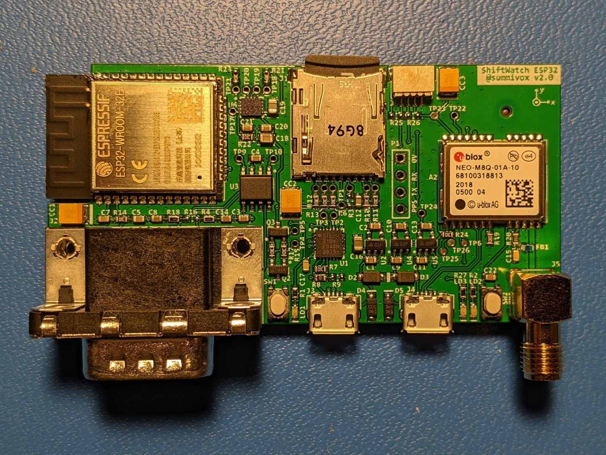
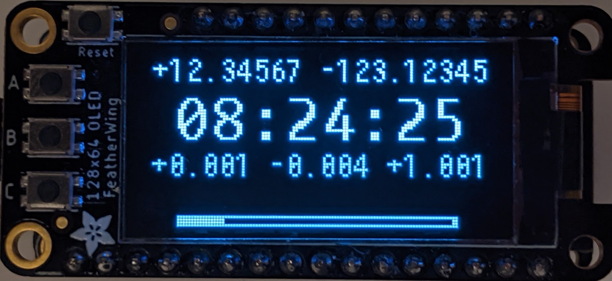
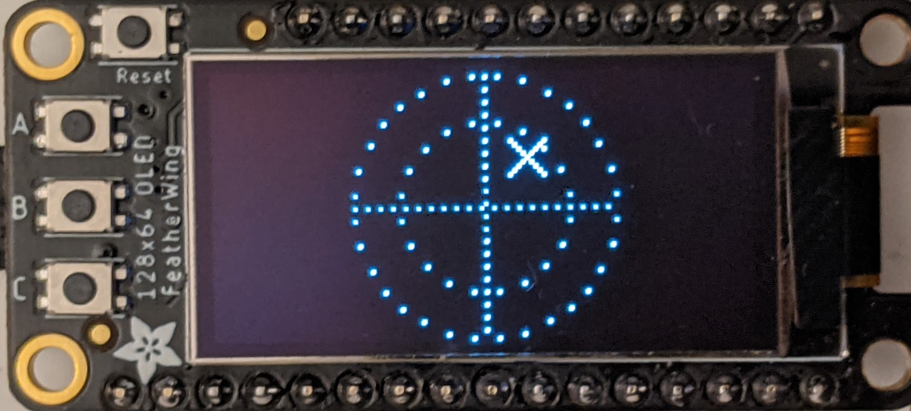
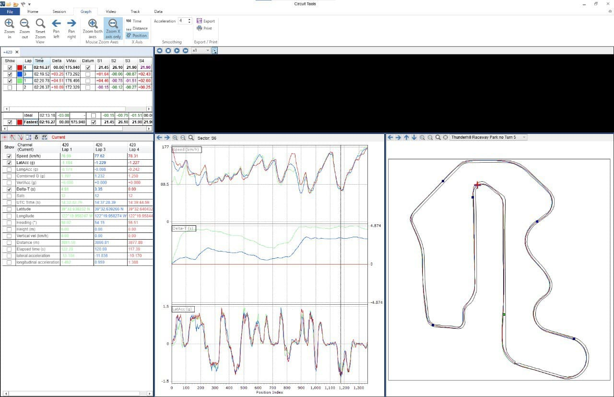
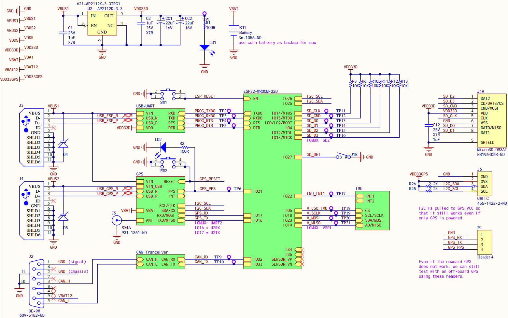
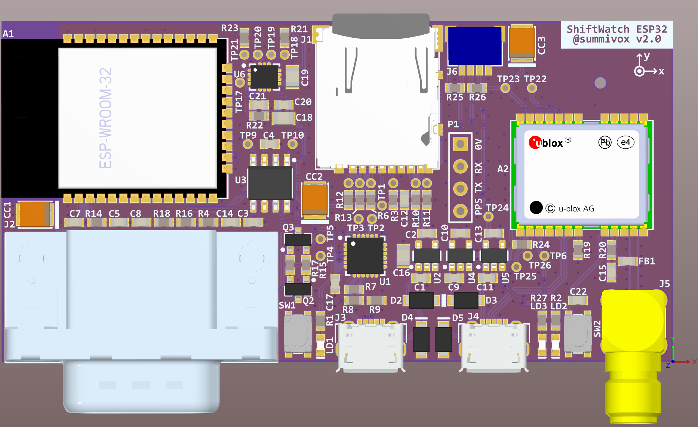

# ShiftWatch (ESP32 edition)

ShiftWatch is a portable standalone data logger intended for collecting automotive performance data. Its core function is to pipe synchronized raw [GNSS][] + [IMU][] + [CAN][] data streams to a MicroSD card.

Photo of current prototype hardware:

## Features

- Human-readable log format
    - One line per message.
    - Each valid NMEA sentence from the GPS module is written verbatim to the log.
- *Every* message is timestamped w.r.t. the GPS UTC clock:
    - Each IMU reading is timestamped by hardware, at the time of *data available*.
    - Each incoming CAN message is likewise timestamped by firmware, at the time of message delivery.
- Real-time visualization through an attached I2C OLED display

## Data Sources

- [uBlox NEO series][ublox] GPS receiver module + external active antenna (SMA connector)
- [ST LSM6 series][lsm6] (LGA14) 6-axis IMU (accelerometer + gyroscope)
- One 5V non-isolated CAN transceiver channel (11/29 bit frames; FD not supported)

## Usage

The device requires the following to be connected:

- **Power**: The entire device is powered through the USB Micro-B jack closest to the DB9. This also serves as the serial debug/programming console of the ESP32.
- **SD card**: A normal Micro-SDHC/XC card inserted into the onboard card slot.
- **GPS**: The GPS module requires an active antenna connected to the threaded female-socket SMA jack. Links: [SparkFun][GPS-ant-1], [Adafruit][GPS-ant-2].
- **CAN**: Default to interfacing with the OBD2 DLC connector (with [standard-compliant termination][OBD2-term]), using a common OBD2-to-DB9 cable (1-2 = GND, 3 = CAN-H, 5 = CAN-L, 9 = 12V battery always-on). Links: [SparkFun][OBD2-cable-1]. **NOTE: This is different from the more common PeakCAN / Kvaser pinout, so do double check!**

## Example

### Visualization

### Offline Analysis

Data captured at [Thunderhill East Racetrack][thill] (using earlier prototype hardware + firmware) was post-processed and converted to a space-separated table format accepted by external tooling for further analysis:

### Sample Data Log

See [this file](doc/sample-log.txt). Note that GPS coordinates are partially redacted for privacy; as a result the checksums will not match.

## Building the Firmware

The firmware is built through [ESP-IDF][], preferrably using the [official VSCode environment/plugin][ESP-IDF-vscode].

## Hardware

More details on the current prototype PCB platform:

While ESP32 has flexible GPIO routing, the following components are fixed in order to take advantage of fast "IOMux" pins:

- 4-bit SD card bus
- SPI bus for the IMU
- UART for the GPS receiver (optional)

The board is extensible through the 4-pin I2C header in the [QWIIC][]/[StemmaQT][] standard. Currently this is used to connect a 128x64 OLED screen (SH1107 controller), such as this one from Adafruit].

Also, the native USB-serial port of the [uBlox NEO][ublox] has its own USB Micro-B connector, which is designed to power only the GPS module, in isolation from the rest of the board.

## Planned Future Work

- **Stabilize log format and post-processing**. Right now the log file format has not been formally specified, although considering the deliberately limited feature set of this device, this should be relatively straightforward as the hardware platform also stabilizes.
- **Sensor Fusion and Calibration**. The goal is to fuse GNSS and IMU signals together, resulting in a higher accuracy vehicle pose signal (e.g. of the vehicle's rear-axle center frame). This requires calibration of rigid transformations among {IMU, Vehicle, GNSS Antenna}.
- **Predictive Lap Timer**. Currently we only show some basic real-time info on the attached I2C OLED screen for diagnostics (mostly making sure the device is still functional). The goal is to also perform predictive lap timing.
- **DBC-based CAN bus parsing**. DBC files are an industry standard for defining signals broadcast on a CAN bus. See the [OpenDBC][] project for examples. Loading a DBC file onto the device will allow us to extract and utilize real-time signals from the CAN bus, e.g. engine RPM, fluid temperatures, vehicle's own IMU, wheel speeds, etc. Note that this will explicitly _not_ affect logging output --- log will always contain raw CAN messages.
- **Enable WiFi/BLE connectivity**. The choice of ESP32 as the main processor is exactly so that we could do this after the core functionality is done.
- **Enclosure Design**. So that I don't have to velcro the naked PCB down to my car's center console anymore...

## Contributions

This project is currently not ready to accept contributions.

[GNSS]: https://en.wikipedia.org/wiki/Satellite_navigation
[PPS]: https://en.wikipedia.org/wiki/Pulse-per-second_signal
[ublox]: https://www.u-blox.com/en/product/neo-m8-series
[GPS-ant-1]: https://www.sparkfun.com/products/14986
[GPS-ant-2]: https://www.adafruit.com/product/960

[IMU]: https://en.wikipedia.org/wiki/Inertial_measurement_unit
[lsm6]: https://www.st.com/en/mems-and-sensors/lsm6dsr.html

[CAN]: https://en.wikipedia.org/wiki/CAN_bus
[OBD2-term]: https://www.eevblog.com/forum/beginners/can-bus-ac-termination-according-to-iso-15765-4/
[OBD2-cable-1]: https://www.sparkfun.com/products/10087
[OpenDBC]: https://github.com/commaai/opendbc

[QWIIC]: https://www.sparkfun.com/qwiic
[StemmaQT]: https://learn.adafruit.com/introducing-adafruit-stemma-qt/what-is-stemma-qt

[ESP-IDF]: https://github.com/espressif/esp-idf
[ESP-IDF-vscode]: https://docs.espressif.com/projects/esp-idf/en/stable/esp32/get-started/vscode-setup.html

[thill]: https://www.thunderhill.com/track-info/track-maps
